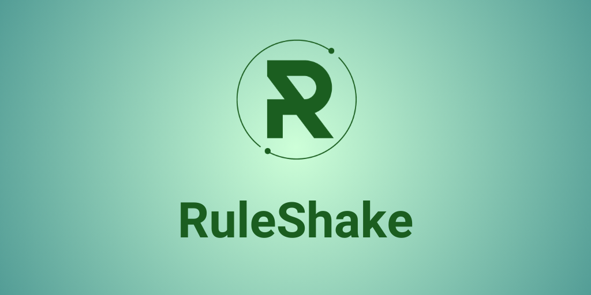
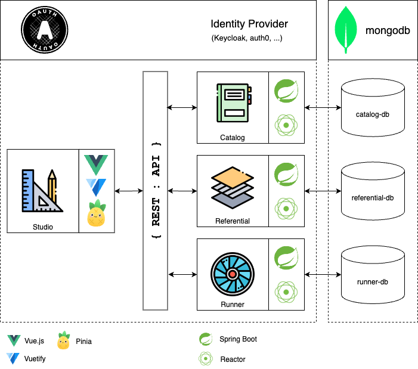

  

RuleShake is a headless, high-performance and scalable calculation engine.
 
Define your rules simply and let RuleShake offer the best personalized package to your customers.

  <a href="https://github.com/ruleshake/ruleshake-start">Start</a> - <a href="https://ruleshake.com/docs/intro">Docs</a> - <a href="https://ruleshake.com/blog/">Blog</a> - <a href="https://demo.ruleshake.com">Demo</a>

Ruleshake is made up of Studio which is its configuration interface, Catalog which is the service for creating and 
configuring variable collections, Referential the dataset management service and Runner the variable collection evaluation service.

  

